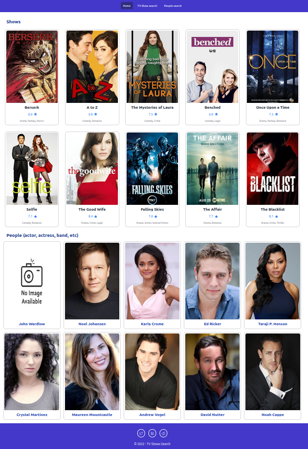
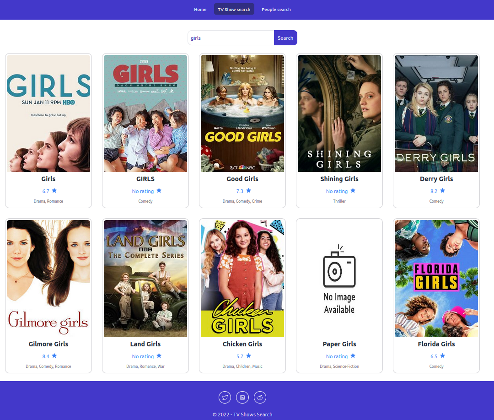

# TV shows application

## Usage

With this app you can search for TV shows and people.

Very simple application to see the possibilities of Nuxt 3 framework.

To run the website in dev mode :

```bash
npm run dev
```

Then go to : http://localhost:3000/

Nuxt 3 is not production ready yet !


## Technologies

* Programming language [Typescript](https://www.typescriptlang.org)
* Javascript framework [Vue.js 3](https://vuejs.org/)
* Vue.js 3 framework [Nuxt 3](https://v3.nuxtjs.org)
* TV show API [TV maze](https://www.tvmaze.com/api)
* CSS framework [Tailwind CSS](https://tailwindcss.com/)

## Screenshots




## Information

Inspired by this video : https://www.youtube.com/watch?v=pIrL2Nnjvbk

I used Node js version 16.14.0.

Sometimes loading can take some seconds because of tvmaze API and it's limited to 20 requests every 10 seconds !

PS: no need to use server/api in reality you can call directly the API tv maze with corresponding urls.
